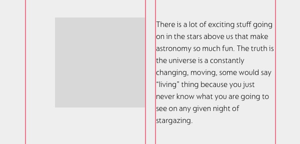
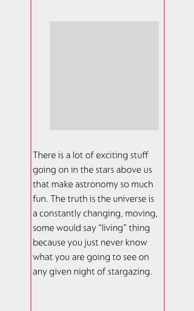
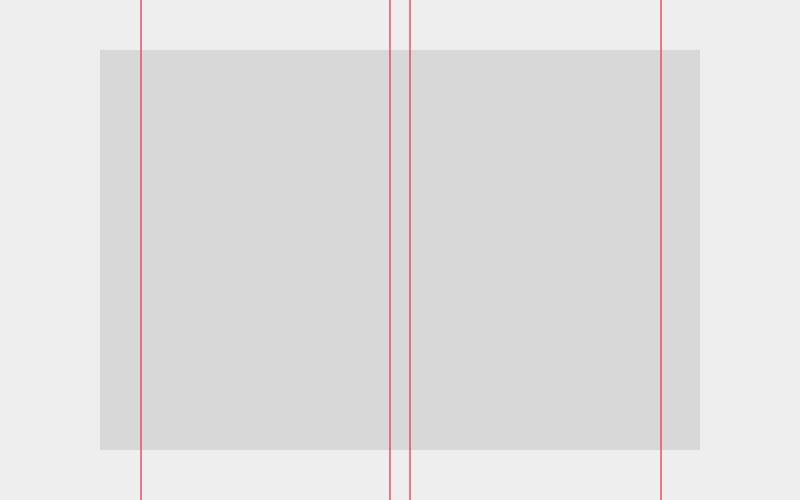
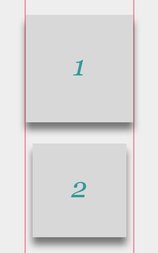

# Designing modern email

## Perspective

Keep in mind that every template file \(photoshop, sketch…\) will be converted into code at some point.  
This guide aims at sharing good practices while designing email templates and preserving mental health among developers.


I use both Photoshop and Sketch to design emails.  They're both ok.

I also use the [MJML framework](https://mjml.io) to develop emails because no one should have to do it by hand nowadays… ever again.


## General knowledge

Email is one of the least advanced type of internet content. It is still being developed with `table` elements and the **huge diversity** of email clients make it almost impossible to achieve 100% compatibility.


I am aiming for the maximum email clients compatibility possible so I won't be using stuff like  `media-queries` as they are not supported by all clients.


### Responsiveness

Emails can be responsive but we have very little control over it.  
As email usually are up to 800px wide, there are only two versions: one desktop and one mobile.  
Thus, what you see on one version will be identical in the other.

For example, if you align an image to the right-hand side on desktop because of a two columns layout, the image will stay right-aligned on the one column mobile version.  
**Which can be weird :**


When designing anything, we tend to think mobile first. Email, for once, follows the trend!


### Columns

Ideally, a one column layout would be the best thing ever. But we know people \(clients and designers\) fear simple stuff. So I'm ok with a two column layout.

### Images

Images are handsomely used in emails. Sometimes too much. In order to be the most readable & accessible possible, avoid putting text on an image. If you have to, don't put a key information on an image. If the client blocks images \(by default on a lot of clients\) your email won't contain the necessary data to be relevant.

If you want to use a drop shadow, be sure to design it **inside** your margins.

### Texts

Use the most real text possible on your email. Text as an image will not do well.

Also, use system fonts like Arial, Trebuchet, Verdana, Times… Most email clients can't display custom fonts so you can't predict which default one will be used.


### **DO NOT use forced line breaks.**

You can create a new paragraph, no problem but you can't make the text pretty. We are not doing print design!

Moreover, forced line breaks will output a weird glyph on some clients.


### Round corners

Avoid them. We can make them work, sure. But is it really necessary? I don't think so.

Some clients support round corners, others don't show them, others break a little.

The only safe way to do that is to export each rounded corner as an image and place them manually around a coloured block. As I said : please avoid them.

## Agency specific stuff

In my agency, I use an email width of 600px with left & right margins from 30px to 50px. Its arbitrary but 600px allows a bit more compatibility with small screens. There is less chance that the layout will break due to a screen 10px too small.

If you have to export images for your beloved developer, export as much .jpg as possible with a maximum quality of 80%. Smaller size images will speed up their loading time.

We know how to make text-on-image work. It's just a bit risky but we can do it. So if you really really want to… go ahead, put that image as a background and throw some text onto it!

