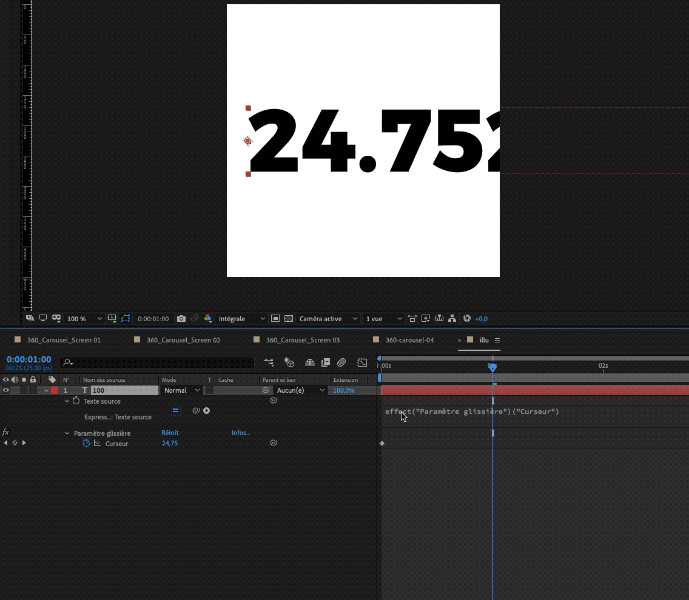

# Expressions in After Effects

## An ever lasting battle.

Expressions in After Effects have always been blurry for me. I know they exist, I know they're powerful, I know it could save a lot of time and clean complex keyframe filled compositions **BUT!** 

#### They are hard to learn.

There is very little documentation and the existing one is hard to find or very old. Very often I just don't have the time to dive into expression learning while animating even though it could help the entire project on the long term.

So the last time I had to do a complex animation, **I took the damn time!**

## The begining of the end \(of keyframes\).

Everyone uses expressions whether they know it or not. Most of the time it's a rather transparent process for the animator. For example: when parenting a property to another one, After Effects creates an expression for us.


Over the last updates, Adobe has made an effort to make expressions more accessible to everyone. For example, the expression box is now resembling a code editor thanks to code-coloring and auto-completion features. After Effects expression feel like JavaScript with custom functions.

Those custom functions can be called through a menu once you enabled the expressions on a property. It offers organized shortcut and proper syntax to all of AE native functions and a bunch of JavaScript standard ones.


## I ain't no developer!

### Why bother?

I know that most animators don't have any kind of development background. However, if Adobe thought it best to let us use expressions, I think we ought to, at least, try.


A lot of incredible professionals like [Mt Mograph](https://www.mtmograph.com/) and [Video Copilot](https://videocopilot.net/) use expressions.


Like every optimization process, building an expressions knowledge takes time. However, like all optimization process, **you will benefit from it afterwards.**

### **Where to learn**

I've gathered a list of my favourite learning grounds. Plenty more exist, **go get'em !**

* [Adobe official expression starter guide \(FR\)](https://helpx.adobe.com/fr/after-effects/using/expression-language-reference.html)
* [Adobe official expression basic \(EN\)](https://helpx.adobe.com/after-effects/using/expression-basics.html)
* [Adobe forums for expressions](https://forums.adobe.com/community/aftereffects_general_discussion/aftereffects_expressions)
* [Creative Cow expressions forums](https://forums.creativecow.net/docs/forums/viewforum.php?tablename=adobe_after_effects_expressions&page=1)
* [Youtube channel about expressions](https://www.youtube.com/playlist?list=PLvr5U5ZSt6IzHyvSL9fo0M9NRPsTvra31)
* [All expressions explained](http://aescript.jecool.net/reference/)
* [Another one](http://expressions.aenhancers.com/index.html)
* [Nice examples of basic expressions](https://www.schoolofmotion.com/tutorials/amazing-expressions-in-after-effects)

## Cas pratique

### Number counter

Let's say you need to animate a rather simple counter from 0% to 100%.

1. Start by creating a text layer. Define your typographic choices, colours, etc.
2. On the _effect_ menu add _expression options_ &gt; _slider control_
3. Alt + Click the _Source text_ property


    4. Parent the _source text_ to the _slider control_ through the _pickwhip._


You should get something like this in the expressions panel :

```javascript
effect("Paramètre glissière")("Curseur")​
```

    5. Set two keyframes on the slider from 0 to 100. The text should update accordingly.  
    6. By default, After Effects does not round numbers. In the expression panel, add a `Math.round()` functions.



```javascript
Math.round(effect("Paramètre glissière")("Curseur"))​
```

Great! We have a working counter. But we wanted a percentage counter. We could add a % glyph in another text layer but let's not.

Still in the expression panel, we're going to add a string containing the % glyph, using basic JavaScript concatenation: `+ '%'`

```javascript
Math.round(effect("Paramètre glissière")("Curseur")) + '%'​
```


**And there we go!** A fully functioning and customizable counter using a slider controller and expressions.

