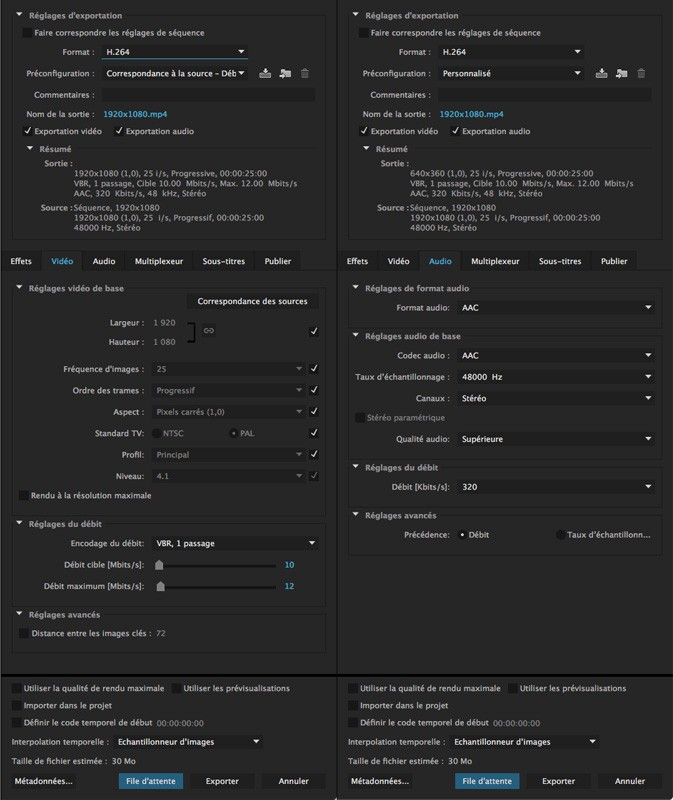
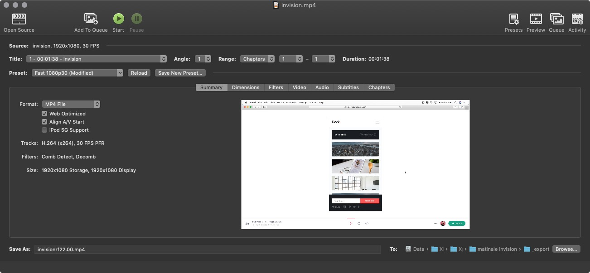
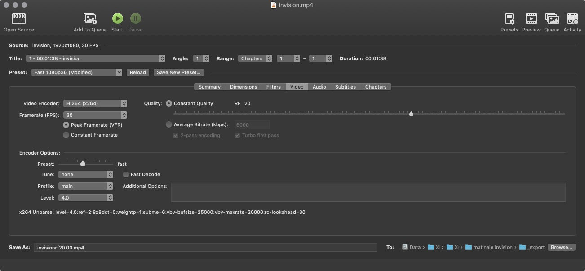
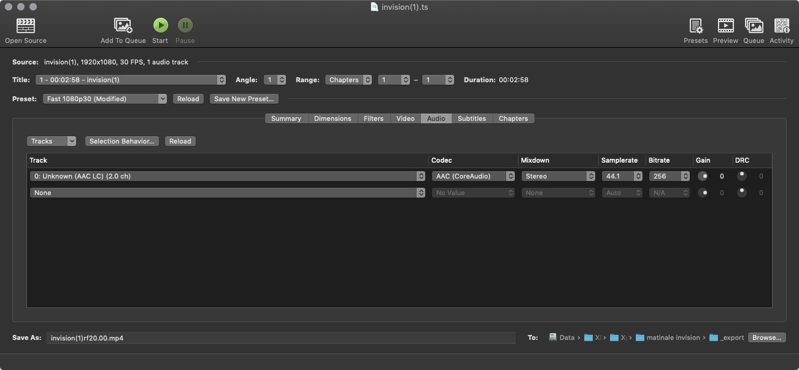

# Video Compression

## Let's play.

Videos are everywhere. **EVERYWHERE!** But videos can and will be huge when 4k becomes an internet standard. Currently, 1920x1080 is king and we usually have no problem hosting or playing this resolution.

## Because we can doesn't mean we should.

Right now, the \(good\) trend of web performance is on the rise. Everyone wants a blazing fast loading website, which might not be possible if we send requests to 100mb \(or even more\) videos.

With a good connection, users will not see the difference. But if we go down that path, nor will they with a 300mb. So the goal is to make every asset as small as possible. It's already the case with images. But it's simpler and faster than video encoding.

## Small size, big quality.

Let's say we exported​ a 1920x1080 video from Premiere Pro with these basic settings:

It's gorgeous, it's Full HD, it's 1:30 minute of excellent editing but it's 50mb… What a shame.

[Let's now use Handbrake!](https://handbrake.fr/) It's free, open source and multi platform.


Please please **PLEASE**. Never export within After Effects.


## Handbrake

### Summary screen

While it's not as sexy as Premiere Pro, it has way more exporting capabilities. Follow these steps to use “passe partout” settings :

1. Open your source video
2. Select a preset corresponding to your future usage like _Fast 1080p30_
3. Check _Web Optimized_

### Video screen

1. Choose _Constant Quality_ and try a value between 20 and 30​ \(higher = smaller\)
2. Choose _Peak Framerate._ If you don't know the framerate, keep the default setting
3. Choose the type of video you are encoding \(film, animation…\)

### Audio screen

If you don't have audio, be sure to set the audio channel to _none_.  
If you have an audio channel, these settings are great and will not influence the size much​:

1. Codec AAC
2. Samplerate 44.1
3. Bitrate 256

### Export!

I used a RF of 25 for this example and no audio.

* My Premiere Pro video was **50,6mb**
* My Handbrake video is **5,5mb​**


### What a save !​


I ended up dividing the original size by 10. Which is cool.  
I tried with a RF of 30. The video was still pretty good and only 3,3mb.

