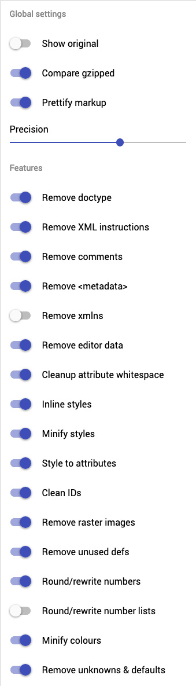
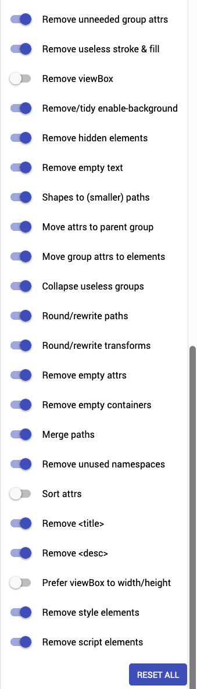

# SVG like a boss

## SVG is life

Using vector images on the web is the best feeling ever. Beeing able to scale up or down a logo without quality loss with files no more than 20ko is great.

However, let's do that properly. When exporting svg from illustrator or sketch, you get some useless code added to the file.



```markup
<!-- Generator: Adobe Illustrator 23.0.3, SVG Export Plug-In . SVG Version: 6.00 Build 0)  -->​
```



```markup
<!-- Generator: Sketch 54.1 (76490) - https://sketchapp.com -->
    <desc>Created with Sketch.</desc>
```



## SVG is love

We have to take care of svg as much as we love it. So we have to clean all the useless bits of code inside it.


A very nice developer built a tool that does exactly that: [**SVGOMG**](https://jakearchibald.github.io/svgomg/)\*\*\*\*


**Svgomg** has a lot of options, so trust me and use them like follows :





## Example

Let's see for ourselves how this tool affects the following svg code.



```markup
<?xml version="1.0" encoding="utf-8"?>
<!-- Generator: Adobe Illustrator 23.0.3, SVG Export Plug-In . SVG Version: 6.00 Build 0)  -->
<svg version="1.1" id="Calque_1" xmlns="http://www.w3.org/2000/svg" xmlns:xlink="http://www.w3.org/1999/xlink" x="0px" y="0px"
	 width="64px" height="64px" viewBox="0 0 64 64" enable-background="new 0 0 64 64" xml:space="preserve">
<title>DSLR Camera</title>
<path fill="#202020" d="M26,2v16h28V2H26z M46,12H34c-1.1,0-2-0.9-2-2s0.9-2,2-2h12c1.1,0,2,0.9,2,2S47.1,12,46,12z"/>
<path fill="#202020" d="M10,24h8v4h-8V24z"/>
<path fill="#202020" d="M57,32h-4.4L48,26l1-4H31l1,4l-4.6,6H7c-1.7,0-3,1.3-3,3v24c0,1.7,1.3,3,3,3h50c1.7,0,3-1.3,3-3V35
	C60,33.3,58.7,32,57,32z M16,48c-2.2,0-4-1.8-4-4s1.8-4,4-4s4,1.8,4,4S18.2,48,16,48z M40,56c-6.1,0-11-4.9-11-11s4.9-11,11-11
	s11,4.9,11,11S46.1,56,40,56z"/>
</svg>
```



```markup
<svg xmlns="http://www.w3.org/2000/svg" width="64" height="64" viewBox="0 0 64 64">
  <path fill="#202020" d="M26 2v16h28V2H26zm20 10H34c-1.1 0-2-.9-2-2s.9-2 2-2h12c1.1 0 2 .9 2 2s-.9 2-2 2zM10 24h8v4h-8v-4z"/>
  <path fill="#202020" d="M57 32h-4.4L48 26l1-4H31l1 4-4.6 6H7c-1.7 0-3 1.3-3 3v24c0 1.7 1.3 3 3 3h50c1.7 0 3-1.3 3-3V35c0-1.7-1.3-3-3-3zM16 48c-2.2 0-4-1.8-4-4s1.8-4 4-4 4 1.8 4 4-1.8 4-4 4zm24 8c-6.1 0-11-4.9-11-11s4.9-11 11-11 11 4.9 11 11-4.9 11-11 11z"/>
</svg>
```



The optimized file \(305 octets\) is 54% smaller than the original \(568 octets\) and 1/3 of the .png alternative \(1ko\). It might not seem like a lot but you don't need x1, x2, x3, etc. versions of your image for it to render properly on all screens!

