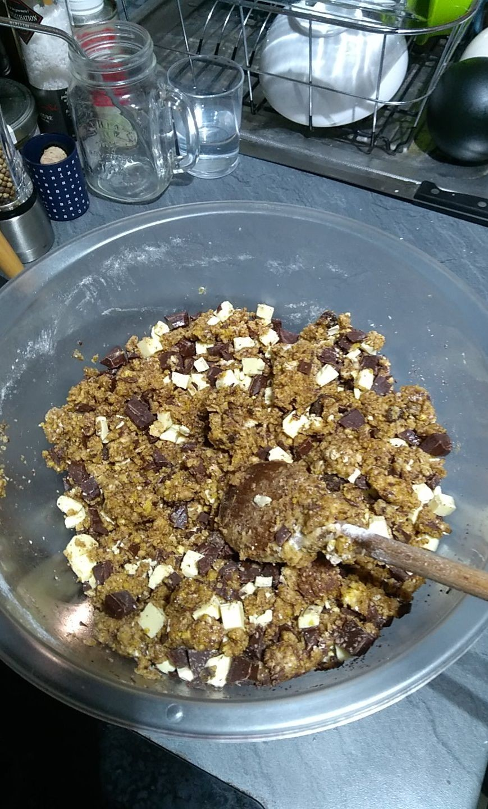
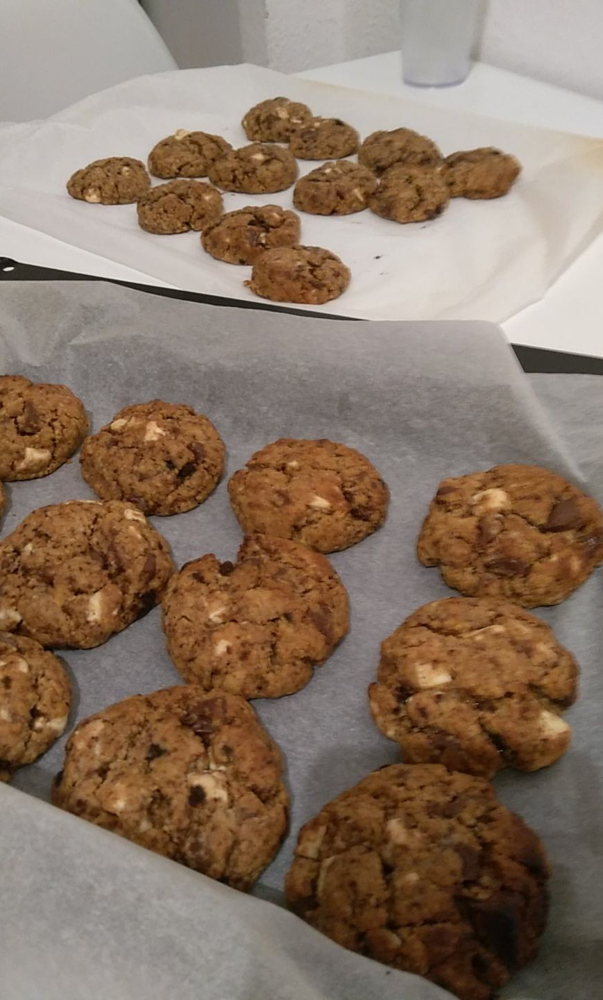

# Les cookies d'A-C

## Version vegan

### Ingrédients

* 250 grammes de farine
* 70 grammes de sucre muscovado
* 20 grammes de cassonade
* 1 pincée de sel
* 1 cuillère à soupe de levure
* 3/4 de l'aquafaba de 400g de pois chiche \(l'eau des pois chiche\)
* 125 grammes d'huile de noix de coco
* 2 cuillères à café de sirop d'érable
* 1 plaquette de chocolat \(noir\) coupée en “ chunks ”

### Méthode

* faire fondre si besoin l'huile de noix de coco à feu doux
* mélanger tous les ingrédients secs pendant ce temps
* ajouter tous les ingrédients liquides \(huile, aquafaba, sirop d'érable\)
* **bien mélanger**
* ajouter le chocolat
* **bien mélanger** \(fig. 1\)

### Cuisson

Réaliser des boules avec la mixture obtenue sur une plaque de cuisson.  
Cuire 9 minutes à 210 degrés \(celsius\) - chaleur tournante \(fig. 2\).

## Version Non-vegan

### Ingrédients

* 250 grammes de farine
* 70 grammes de sucre muscovado
* 20 grammes de cassonade
* 1 pincée de sel
* 1 cuillère à soupe de levure
* 1 œuf
* 125 grammes de beurre fondu
* 2 cuillères à café de miel
* 1 plaquette de chocolat \(noir/blanc/les deux\) coupée en “ chunks ”

### Méthode

* faire fondre le beurre à feu doux
* mélanger tous les ingrédients secs pendant ce temps
* ajouter tous les ingrédients liquides \(beurre fondu, œuf, miel\)
* **bien mélanger**
* ajouter le chocolat
* **bien mélanger** \(fig. 1\)

### Cuisson

Réaliser des boules avec la mixture obtenue sur une plaque de cuisson.  
Cuire 9 minutes à 210 degrés \(celsius\) - chaleur tournante \(fig. 2\).

## Notes

Le chocolat peut-être remplacé par n'importe quoi comme des noix, des raisins secs, des légos… \(mangez pas des légos soyez sérieux\).

## Figures

